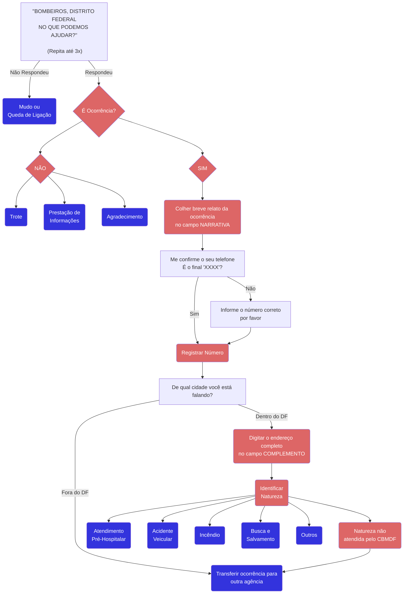
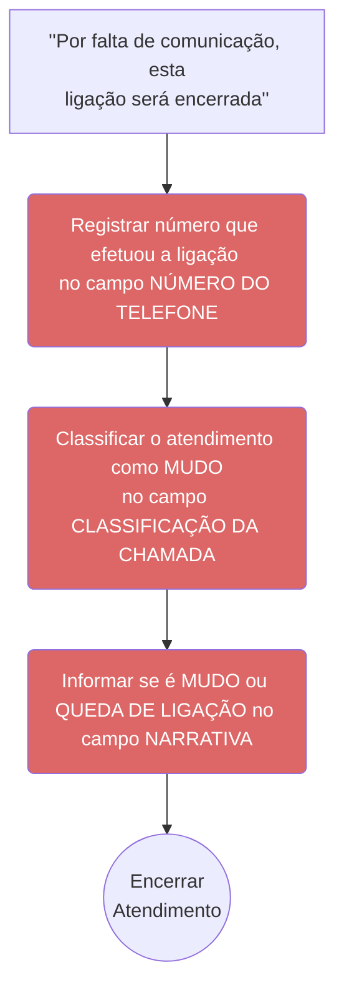
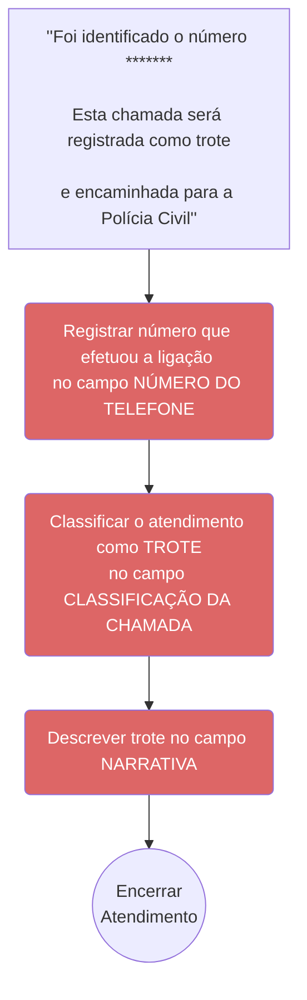
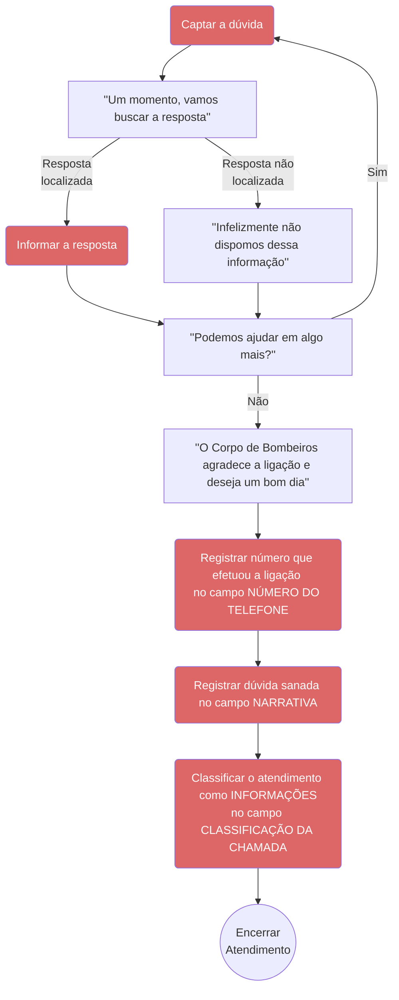
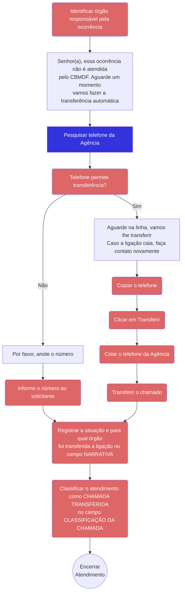

# Início

## Atendimento da Chamada

## Incidente

### Mudo ou Queda de Ligação

### Trote

### Prestação de Informações

### Agradecimento

## Ocorrência

{/* /import Formulario from '@site/src/components/emergencia-medica/FormAvaliacaoInicial'

<Formulario/> */}

### Transferir Ocorrência

