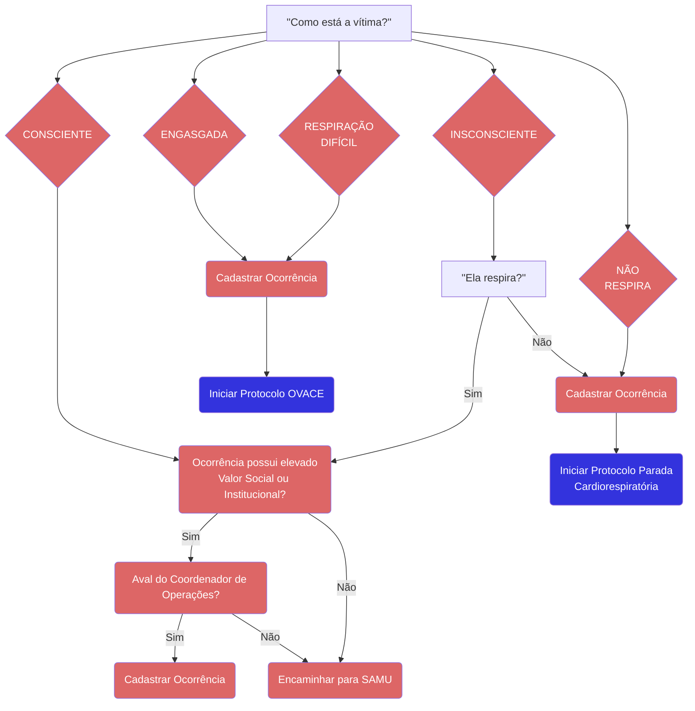

# Atendimento Pré-Hospitalar

```mermaid
flowchart TD
    A["''Como está a vítima?''"]
    A --> B{CONSCIENTE}:::atendente ----> J(Ocorrência possui elevado\nValor Social ou Institucional?):::atendente
    J -->|Sim|H(Aval do Coordenador de Operações?):::atendente
    J -->|Não|L(Encaminhar para SAMU):::atendente
    H -->|Sim|I(Cadastrar Ocorrência):::atendente
    H -->|Não|L
    A --> C{ENGASGADA}:::atendente -->F0(Cadastrar Ocorrência):::atendente --> F("Iniciar Protocolo OVACE"):::link
    A --> D{RESPIRAÇÃO\nDIFÍCIL}:::atendente -->F0
    A --> E{INSCONSCIENTE}:::atendente --> G["''Ela respira?''"]
    A --> M{NÃO\nRESPIRA}:::atendente -->K0(Cadastrar Ocorrência):::atendente --> K("Iniciar Protocolo Parada\nCardiorespiratória"):::link
    G --> |Sim|J
    G --> |Não|K0
    
    

    classDef atendente fill:#d66, color:#fff
    classDef link fill:#33d, color:#fff

    click K "/protocolo-193/operacoes/pcr" "Parada Cardiorrespiratória"
    click F "/protocolo-193/operacoes/ovace" "OVACE"

``` 