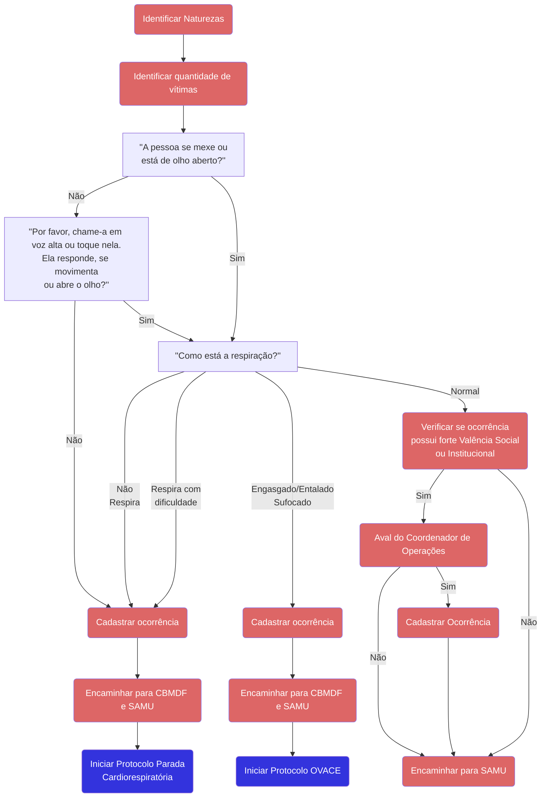

# Atendimento Pré-Hospitalar

```mermaid
flowchart TD
    A0(Identificar Naturezas):::atendente-->A1(Identificar quantidade de vítimas):::atendente
    A1-->A["''A pessoa se mexe ou\nestá de olho aberto?''"] -->|Não|B["''Por favor, chame-a em voz alta ou toque nela.\nEla responde, se movimenta\nou abre o olho?''"]
    B -->|Sim|C["''Como está a respiração?''"]
    A -->|Sim|C
    B ---->|Não|B1(Cadastrar ocorrência):::atendente
    B1 --> B2(Encaminhar para CBMDF e SAMU):::atendente
    B2 --> D("Iniciar Protocolo Parada\nCardiorespiratória"):::link
    C ---->|Não\nRespira|B1
    C ---->|Respira com\ndificuldade|B1
    C ---->|Engasgado/Entalado\nSufocado|C1(Cadastrar ocorrência):::atendente
    C1 --> C2(Encaminhar para CBMDF e SAMU):::atendente
    C2 -->F("Iniciar Protocolo OVACE"):::link
    C -->|Normal|G(Verificar se ocorrência\npossui forte Valência Social\nou Institucional):::atendente
    G -->|Sim|H(Aval do Coordenador de Operações):::atendente
    H -->|Sim|I(Cadastrar Ocorrência):::atendente
    H --->|Não|J(Encaminhar para SAMU):::atendente
    I --->J
    G --->|Não|J

    classDef atendente fill:#d66, color:#fff
    classDef link fill:#33d, color:#fff

    click D "/protocolo-193/operacoes/pcr" "Parada Cardiorrespiratória"
    click F "/protocolo-193/operacoes/ovace" "OVACE"

``` 
