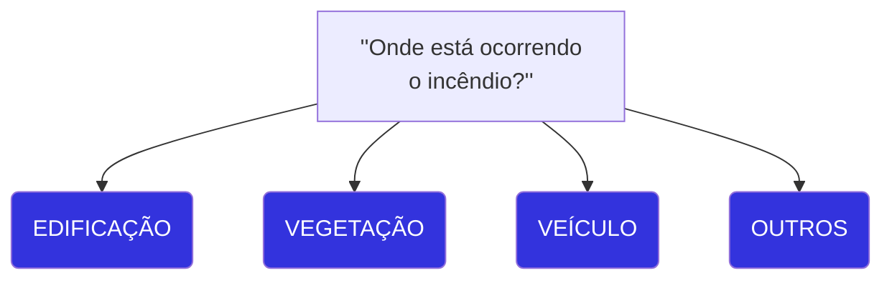

# Incêndio

```mermaid
flowchart TD
    A["''Onde está ocorrendo\no incêndio?''"]
    A --> B(EDIFICAÇÃO):::link 
    A --> C(VEGETAÇÃO):::link
    A --> D(VEÍCULO):::link
    A --> E(OUTROS):::link

    classDef atendente fill:#d66, color:#fff
    classDef link fill:#33d, color:#fff

    click B "/protocolo-193/operacoes/incendio_edificacao" "Incêndio em Edificação"
    click C "/protocolo-193/operacoes/incendio_vegetacao" "Incêndio em Vegetação"
    click D "/protocolo-193/operacoes/incendio_veiculo" "Incêndio em Veículo"
    click E "/protocolo-193/operacoes/incendio_outros" "Outros Incêndios"

``` 