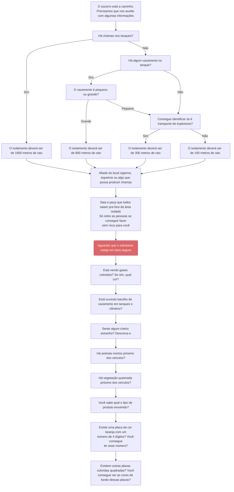

# Acidente com veículo de transporte de produtos perigosos

<!-- 
## Considerações iniciais

i) Oriente a sinalizar o local do acidente a uma distância mínima de 100 metros, mas caso consiga identificar como sendo um transporte de “explosivos”, aumente o isolamento em 300 metros;
ii) Atentar para que não acendam cigarros, isqueiros ou algo que possa produzir chamas nas proximidades.

## Orientações gerais

i) “Afaste-se imediatamente do veículo principalmente se no local você observar: gases coloridos ou barulho de vazamento em tanques e cilindros; animais mortos próximo dos caminhões; vegetação próxima aos tanques queimada (tendo como parâmetro a vegetação do local); e cheiros estranhos”;
ii) “Você sabe qual o tipo de produto envolvido? Existe uma placa de cor laranja com um número de 4 dígitos? Você consegue ler esse número?
iii) Existem outras placas coloridas quadradas? Você consegue ver as cores de fundo dessas placas?
iv) Pequenos vazamentos de líquidos ou cargas sólidas (pós ou grãos): “É preciso que você se afaste pelo menos 100 metros do local”;
v) Grandes vazamentos de líquidos ou gases em geral: “É preciso que você se afaste pelo menos 800 metros do local”;
vi) Chamas em tanques (sendo ou não tanque combustível poderá explodir): “É preciso que se afaste pelo menos 1600 metros nos casos de tanques de combustíveis (líquidos ou gases inflamáveis)”;
vii) Vítimas caídas: “Só retire as pessoas se conseguir fazer sem risco para você. -->
