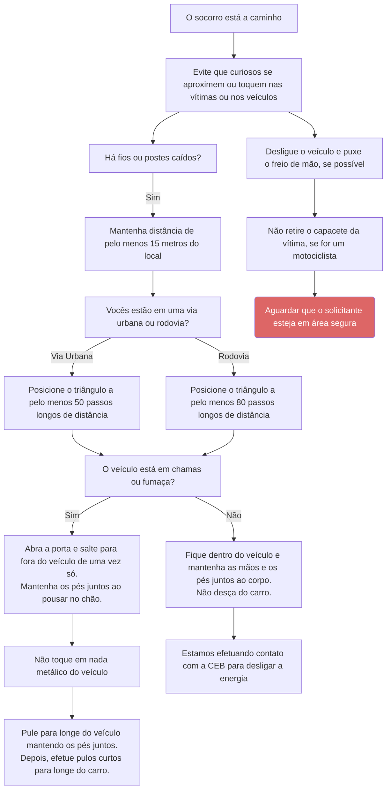

# Acidente automobilístico

<!-- ## Considerações iniciais

i) Oriente a ficar fora da pista e sinalize com o triângulo do veículo, galhos ou outros objetos na pista para sinalizar o trânsito. Nas vias urbanas a uma distância mínima de 50 passos longos do acidente e em rodovias a uma distância mínima de 80 passos longos do acidente;
ii) “Evite que curiosos se aproximem ou toquem nas vítimas ou nos veículos.”;
iii) Havendo possibilidade, mande desligar o veículo e puxar o freio de mão;
iv) Em caso de motociclista, oriente a não retirar o capacete da vítima!

## Acidente envolvendo Queda de Fio ou Poste de Eletricidade

a) “Os fios podem estar energizados. Não tente movê-los”;
b) “O chão deve estar energizado e você pode tomar um choque”;
c) “Afaste todas as pessoas de perto. Mantenha distância de pelo menos 15m do local”;
d) Fiação elétrica caída sobre veículo com pessoas no interior;
e) Caso o veículo não esteja em chamas/fumaça:
   - “Fique dentro do veículo e mantenha as mãos e os pés juntos ao corpo, estamos efetuando contato com a CEB para desligar a energia.”
   - “O chão deve estar energizado e você pode tomar um choque. Não desça do carro.”
f) “Caso o veículo esteja incendiando ou com fumaça:
   - “Não toque em nada metálico do veículo.”
   - “Abra a porta e salte para fora do veículo de uma vez só. Mas você tem que saltar e cair com os pés juntos.”
g) Não toque o carro quando os pés entrarem em contato com o solo.
h) Depois, efetue pulos curtos, mantendo os pés juntos. Mova-se desta forma para longe do carro para pelo menos 10 metros de distância”. -->
