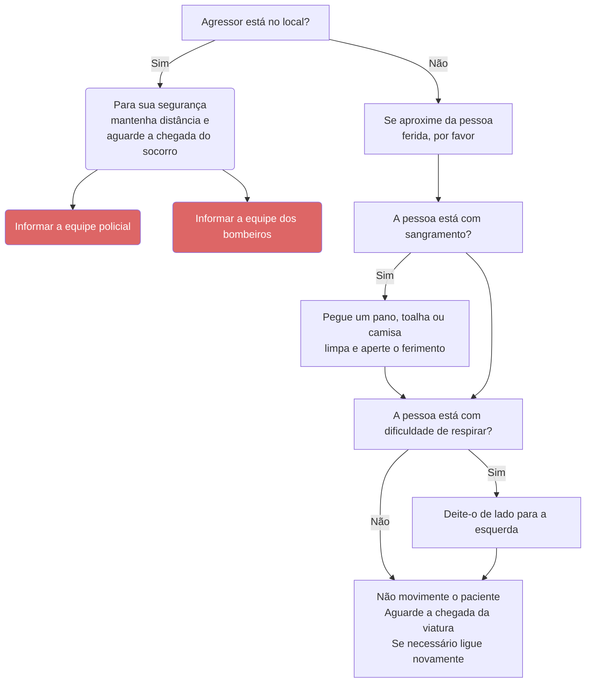

# Ferimento por arma de fogo ou arma branca

<!-- # Ferimento por arma de fogo ou arma branca

## Considerações gerais

i) Interrompa a ligação somente após a chegada da viatura no local ou a melhora do paciente, oferecendo continuamente as orientações;
   - Acione apoio policial nas causas externas que existam agressores (PAF, PAB ou agressão física).

## Orientações ao solicitante

a) “O agressor está no local?”;
   - Se sim ou se não sabe: “Mantenha distância.” ou “Fique longe.”;
   - Se não: “Se aproxime do paciente” ou “Chegue perto do paciente.”;

b) “Tem algum sangramento maior?”;
   - Se sim: “Pegue um pano ou toalha ou camisa limpa e aperte o ferimento para evitar sangramento excessivo.”;
   - “Não movimente o paciente.”;

c) Se o paciente estiver com dificuldade de respirar: “Deite-o do lado esquerdo.”;

d) Finalizar a ligação com: “Senhor(a), deixe o paciente desse jeito e aguarde a chegada da viatura. Se necessário ligue novamente.” -->
