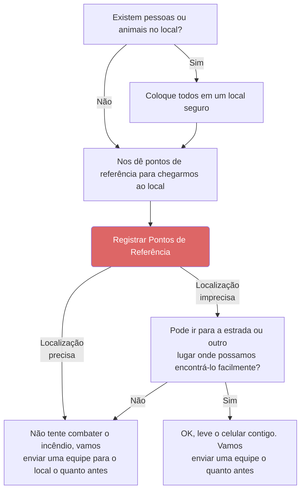

# Incêndio em Vegetação

## Iniciar

```mermaid
graph TD;
    existe_pessoa["Existem pessoas ou animais no local?"]-->|Sim|pedir_sair["Coloque todos em um local seguro"]
    existe_pessoa -->|Não| ponto_referencia["Nos dê pontos de referência para chegarmos ao local"]
    pedir_sair --> ponto_referencia
    ponto_referencia --> registrar_pontos(Registrar Pontos de Referência):::atendente
    registrar_pontos --> |Localização\nprecisa|orientacao_final["Não tente combater o incêndio, vamos\nenviar uma equipe para o local o quanto antes"]
    registrar_pontos --> |Localização\nimprecisa|ir_para_estrada["Pode ir para a estrada ou outro\nlugar onde possamos encontrá-lo facilmente?"]
    ir_para_estrada --> |Sim|levar_celular["OK, leve o celular contigo. Vamos\nenviar uma equipe o quanto antes"]
    ir_para_estrada --> |Não|orientacao_final

    classDef atendente fill:#d66, color:#fff
```
