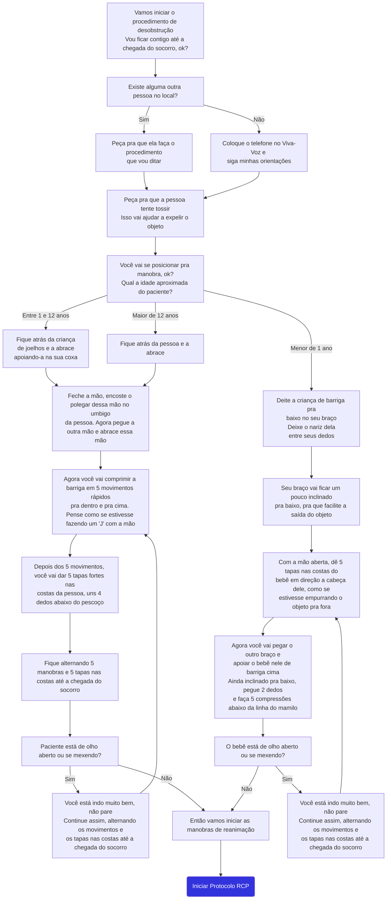

# Obstrução de Vias Aéreas por Corpo Estranho (OVACE)

## Iniciar

```mermaid
graph TD;
    inicio[Vamos iniciar o procedimento de desobstrução\nVou ficar contigo até a chegada do socorro, ok?]
    inicio --> existe_outra_pessoa["Existe alguma outra pessoa no local?"]-->|Sim|pedir_fazer_procedimento["Peça pra que ela faça o procedimento\nque vou ditar"]
    existe_outra_pessoa -->|Não| colocar_viva_voz["Coloque o telefone no Viva-Voz e \nsiga minhas orientações"]
    pedir_fazer_procedimento --> estimulo_tosse["Peça pra que a pessoa tente tossir\nIsso vai ajudar a expelir o objeto"]
    colocar_viva_voz --> estimulo_tosse
    estimulo_tosse --> verificar_idade["Você vai se posicionar pra manobra, ok?\nQual a idade aproximada do paciente?"]
    verificar_idade --> |Menor de 1 ano|posicionar_bebe["Deite a criança de barriga pra\nbaixo no seu braço\nDeixe o nariz dela\nentre seus dedos"]
    verificar_idade --> |Entre 1 e 12 anos|posicionar_crianca["Fique atrás da criança\nde joelhos e a abrace\napoiando-a na sua coxa"]
    verificar_idade --> |Maior de 12 anos|posicionar_adulto["Fique atrás da pessoa e a abrace"]
    posicionar_crianca --> posicionar_mao["Feche a mão, encoste o polegar dessa mão no umbigo\nda pessoa. Agora pegue a outra mão e abrace essa mão"]
    posicionar_adulto --> posicionar_mao
    posicionar_mao --> movimentar_mao["Agora você vai comprimir a barriga em 5 movimentos rápidos\npra dentro e pra cima. Pense como se estivesse fazendo um 'J' com a mão"]
    movimentar_mao --> tapotagem_adulto["Depois dos 5 movimentos, você vai dar 5 tapas fortes nas\ncostas da pessoa, uns 4 dedos abaixo do pescoço"]
    tapotagem_adulto --> alternar_manobras["Fique alternando 5 manobras e 5 tapas nas costas até a chegada do socorro"]
    alternar_manobras --> verificar_paciente["Paciente está de olho aberto ou se mexendo?"]
    verificar_paciente --> |Sim|continuar_procedimento["Você está indo muito bem, não pare\nContinue assim, alternando os movimentos e\nos tapas nas costas até a chegada do socorro"]
    continuar_procedimento --> movimentar_mao
    verificar_paciente --> |Não|iniciar_rcp["Então vamos iniciar as manobras de reanimação"]
    iniciar_rcp -->ir_para_rcp("Iniciar Protocolo RCP"):::link

    posicionar_bebe --> inclinar_braco["Seu braço vai ficar um pouco inclinado\npra baixo, pra que facilite a saída do objeto"]
    inclinar_braco --> tapotagem_bebe["Com a mão aberta, dê 5 tapas nas costas do\nbebê em direção a cabeça dele, como se\nestivesse empurrando o objeto pra fora"]
    tapotagem_bebe --> compressao_bebe["Agora você vai pegar o outro braço e\napoiar o bebê nele de barriga cima\nAinda inclinado pra baixo, pegue 2 dedos\ne faça 5 compressões abaixo da linha do mamilo"]
    compressao_bebe --> verificar_bebe["O bebê está de olho aberto ou se mexendo?"]
    verificar_bebe --> |Sim|continuar_procedimento_bebe["Você está indo muito bem, não pare\nContinue assim, alternando os movimentos e\nos tapas nas costas até a chegada do socorro"]
    continuar_procedimento_bebe --> tapotagem_bebe
    verificar_bebe --> |Não|iniciar_rcp
  

    

    classDef atendente fill:#d66, color:#fff
    classDef link fill:#33d, color:#fff
    click ir_para_rcp "/protocolo-193/operacoes/pcr" "Parada Cardiorrespiratória"

```