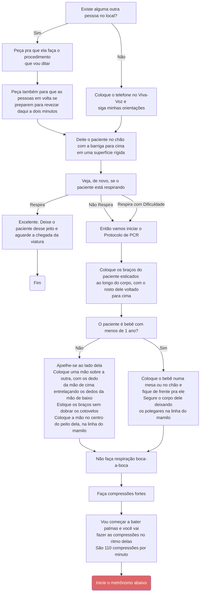
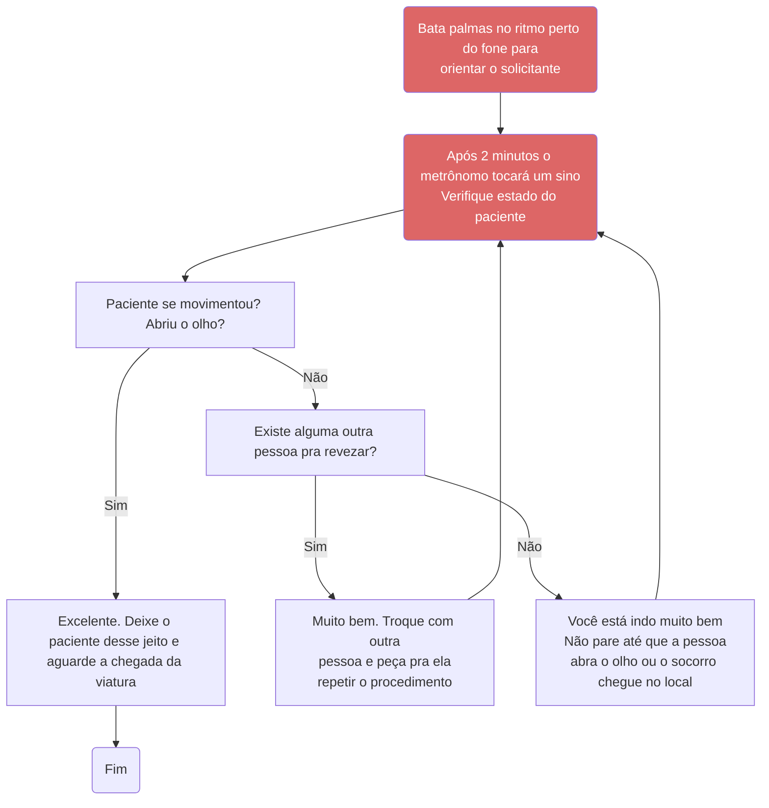

# Parada respiratória ou cardiorrespiratória

import Metronome from '@site/src/components/Metronome';

## Fluxo

```mermaid
graph TD;
    existe_outra_pessoa[Existe alguma outra pessoa no local?]-->|Sim|pedir_fazer_procedimento[Peça pra que ela faça o procedimento\nque vou ditar]
    pedir_fazer_procedimento --> pedir_revezamento[Peça também para que as pessoas em volta se\npreparem para revezar daqui a dois minutos]
    existe_outra_pessoa -->|Não| colocar_viva_voz[Coloque o telefone no Viva-Voz e \nsiga minhas orientações]
    pedir_revezamento --> deitar_paciente[Deite o paciente no chão com a barriga para cima\nem uma superfície rígida]
    colocar_viva_voz --> deitar_paciente
    deitar_paciente --> verificar_respiracao[Veja, de novo, se o paciente está respirando]
    verificar_respiracao -->|Respira|aguardar_viatura[Excelente. Deixe o paciente desse jeito e \naguarde a chegada da viatura]
    verificar_respiracao -->|Não Respira|iniciar_protocolo_pcr[Então vamos iniciar o Protocolo de PCR]
    verificar_respiracao -->|Respira com Dificuldade|iniciar_protocolo_pcr
    aguardar_viatura --> fim_atendimento(Fim)
    iniciar_protocolo_pcr --> posicionar_bracos[Coloque os braços do paciente esticados \nao longo do corpo, com o rosto dele voltado\npara cima]
    posicionar_bracos --> verificar_idade[O paciente é bebê com menos de 1 ano?]
    verificar_idade --> |Não|posicionar_adulto[Ajoelhe-se ao lado dela\nColoque uma mão sobre a outra, com os dedo\nda mão de cima entrelaçando os dedos da mão de baixo\nEstique os braços sem dobrar os cotovelos\nColoque a mão no centro do peito dela, na linha do mamilo]
    verificar_idade --> |Sim|posicionar_bebe[Coloque o bebê numa mesa ou no chão e\nfique de frente pra ele\nSegure o corpo dele deixando\nos polegares na linha do mamilo]
    posicionar_adulto --> orientacao_boca_boca[Não faça respiração boca-a-boca]
    posicionar_bebe --> orientacao_boca_boca
    orientacao_boca_boca --> orientacao_compressoes[Faça compressões fortes]
    orientacao_compressoes --> orientar_compressoes[Vou começar a bater palmas e você vai\nfazer as compressões no ritmo delas\nSão 110 compressões por minuto]
    orientar_compressoes --> abrir_metronomo(Inicie o metrônomo abaixo):::atendente

    classDef atendente fill:#d66, color:#fff
    classDef link fill:#33d, color:#fff
    click abrir_metronomo "#iniciar-metrônomo" "Metrônomo"
    click aguardar_viatura_2 "../." "Retornar" _blank

```
## Iniciar Metrônomo

<Metronome/>

##

```mermaid
    graph TD;
    iniciar_rcp(Bata palmas no ritmo perto do fone para\norientar o solicitante):::atendente --> marcar_tempo(Após 2 minutos o metrônomo tocará um sino\nVerifique estado do paciente):::atendente
    marcar_tempo --> verificar_paciente[Paciente se movimentou? Abriu o olho?]
    verificar_paciente ----> |Sim|aguardar_viatura_2[Excelente. Deixe o paciente desse jeito e \naguarde a chegada da viatura] --> fim_atendimento2(Fim)
    verificar_paciente --> |Não|verificar_novamente_revezamento[Existe alguma outra pessoa pra revezar?]
    verificar_novamente_revezamento ---> |Sim|pedir_para_revezar[Muito bem. Troque com outra\npessoa e peça pra ela\nrepetir o procedimento]
    verificar_novamente_revezamento ---> |Não|estimular_solicitante[Você está indo muito bem\nNão pare até que a pessoa\nabra o olho ou o socorro chegue no local]
    pedir_para_revezar --> marcar_tempo
    estimular_solicitante --> marcar_tempo
    classDef atendente fill:#d66, color:#fff
    classDef link fill:#33d, color:#fff
```
