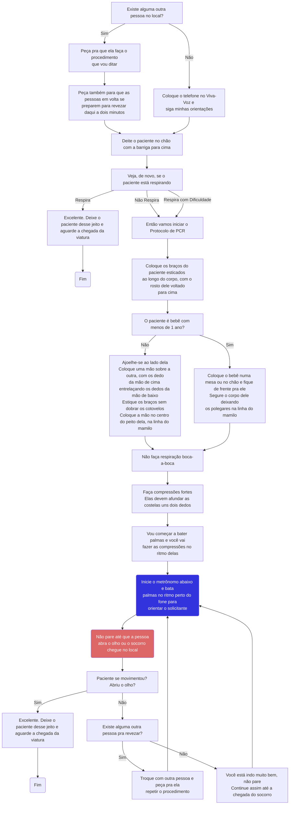

# Parada respiratória ou cardiorrespiratória

import Metronome from '@site/src/components/Metronome';

## Fluxo

## Metrônomo

<Metronome/>
{/* ## Considerações gerais

- Pergunte se existe alguma pessoa com treinamento em primeiros socorros no local.
- Interrompa a ligação somente após a chegada da viatura no local ou a melhora do paciente, oferecendo continuamente as orientações.
- Se houver suspeita ou dúvida de estar a vítima em PCR, oriente o início da RCP, porque há mais malefícios na demora do início das manobras do que iniciar em uma vítima com batimentos cardíacos.

## Quando o solicitante for leigo

- "Deite o paciente no chão com a barriga para cima."
- "Veja, de novo, se o paciente está respirando."
- Se estiver respirando normalmente, interrompa o protocolo e finalize a ligação: "Senhor(a), deixe o paciente desse jeito e aguarde a chegada da viatura."
- Se não respira ou se estiver respirando com dificuldade, como respiração do tipo gasping, também conhecido como respiração do tipo 'peixe fora da água', passar para o item 5;
- "Tem outra pessoa por perto para ajudar?"
  - Se sim: "Fica uma no telefone e outra fazendo as manobras."
  - Se não: "Deixa o telefone no viva-voz e siga o passo-a-passo."
- "Eu vou te orientar o que fazer."
  - "Coloque os braços do paciente ao longo do corpo, com o rosto voltado para cima, não de lado."
  - "Ajoelhe-se ao lado do corpo e não faça respiração boca-a-boca."
  - "Coloque uma mão sobre a outra, entrelaçando os dedos, esticando os braços sem dobrar os cotovelos."
  - "Deixe as mãos no meio do peito, na altura dos mamilos, e faça compressões rápidas (perto de 100 a 120 por minuto) e fortes (como se afundassem as costelas), sem parar."
  - A cada 2 minutos: "Troque as compressões com outra pessoa e não pare até a chegada da viatura no local."
  - Se não tiver outra pessoa: "Continue assim, sem parar, até a chegada da viatura."
- A cada 2 minutos, pergunte se há mudanças: "Paciente se movimentou? Abriu o olho?"
- A qualquer momento, ofereça palavras de apoio e estímulo: "É isso, continue assim.", "a Viatura está caminho.", "Estamos juntos." ou outros dizeres similares;
- "Vamos fazer tudo que for possível", "Continue firme, sua ajuda é muito importante."
- Se retornar a circulação espontânea, com o paciente voltando a respirar sem dificuldade, finalize a ligação: "Senhor(a), deixe o paciente desse jeito e aguarde a chegada da viatura."

## Quando o solicitante tiver conhecimento em primeiros socorros:

- "Deite o paciente no chão em decúbito dorsal."
- "Avalie a respiração do paciente."
- Comece as compressões na proporção de 30 por 2, se tiver equipamento para as ventilações.
- Se não tiver equipamento: "Não faça ventilações."
- "Faça sempre um ritmo de (pelo menos 100 compressões por minuto)."
- A cada 2 minutos: "Verifique o pulso carotídeo e troque a pessoa que faz as compressões."
- Após 2 minutos, caso não haja pulso e havendo DEA - Desfibrilador Externo Automático disponível: "Ligue o DEA e siga as orientações até a chegada da viatura no local."
- A qualquer momento, se o DEA indicar choque: "Cuidado! Não deixe ninguém encostar no paciente."
- "Reinicie a RCP após o choque por mais 2 minutos, antes de checar o pulso novamente." */}
